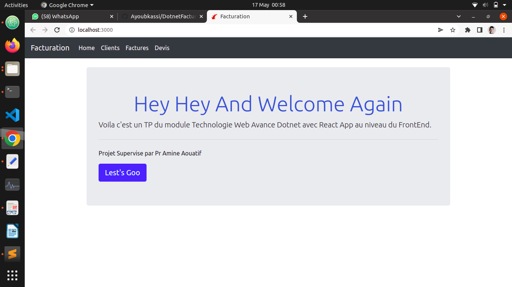
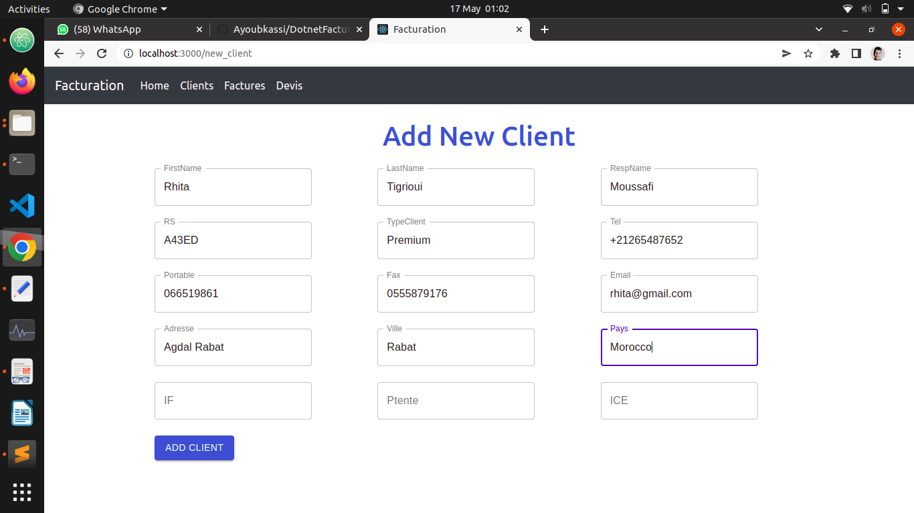
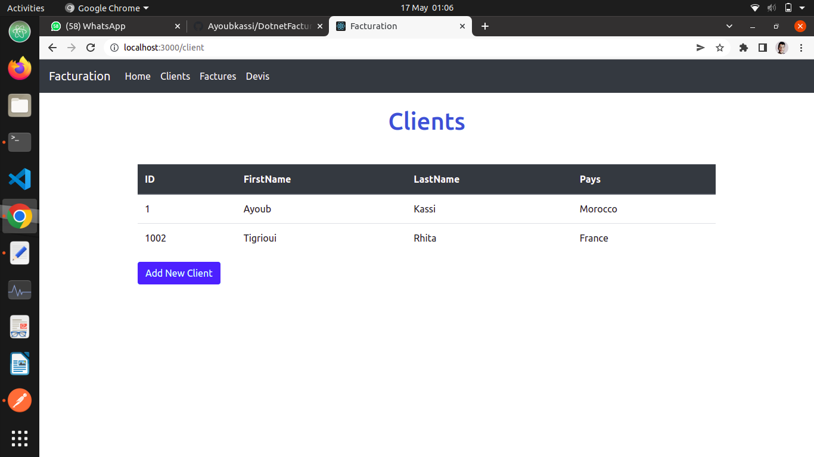
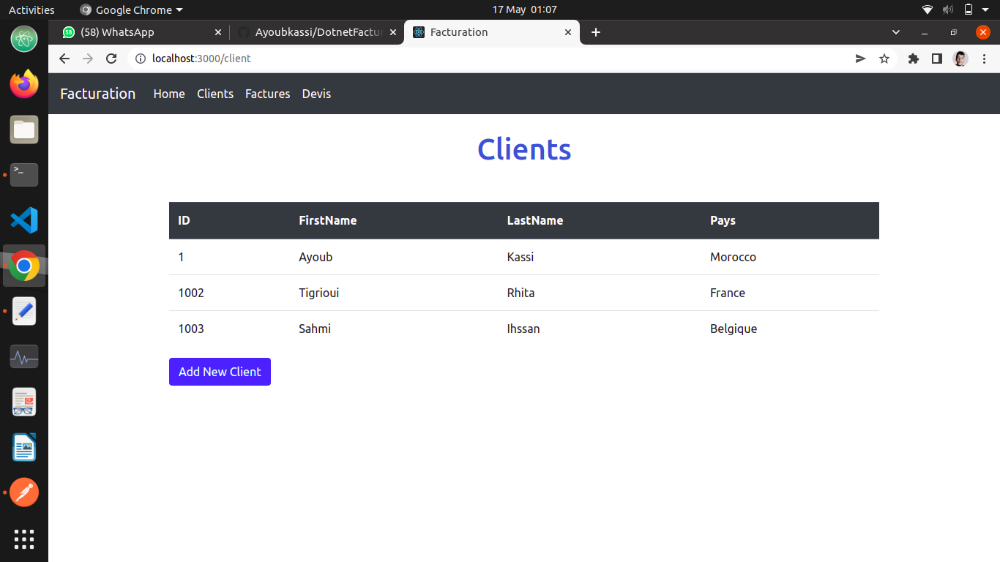
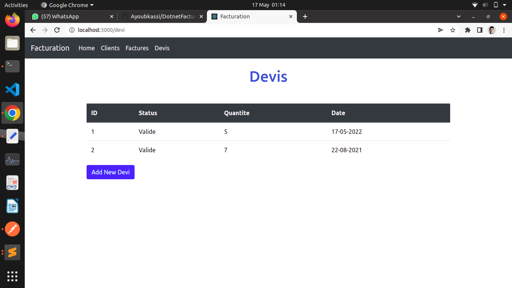
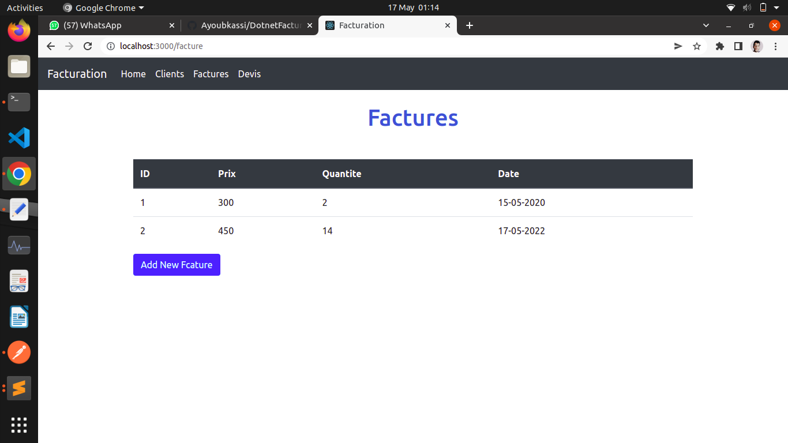
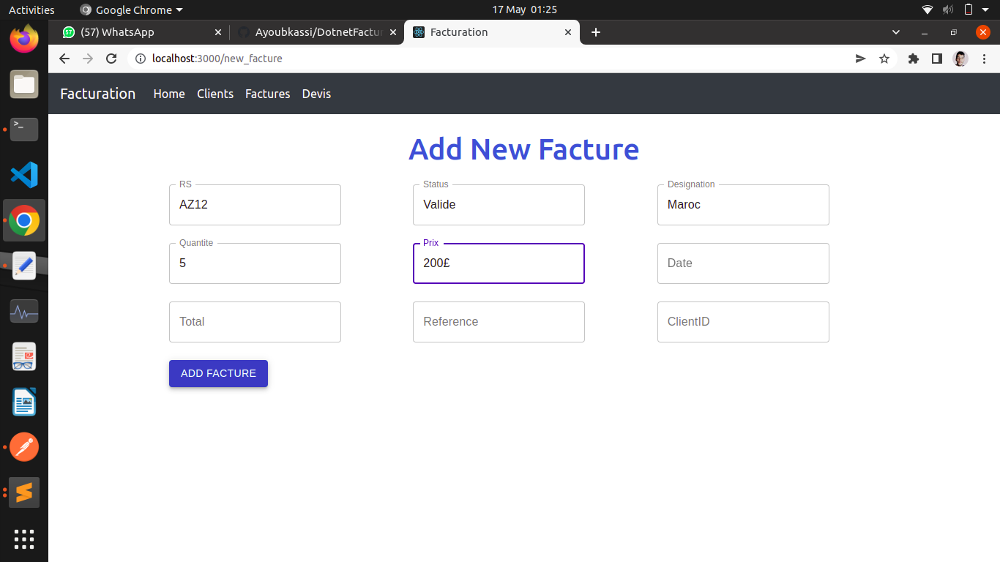
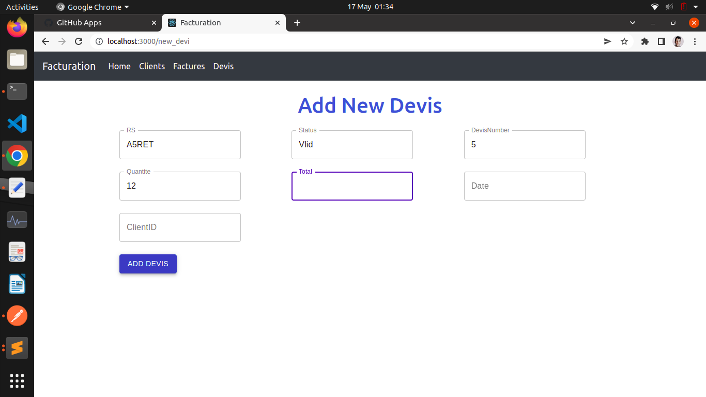
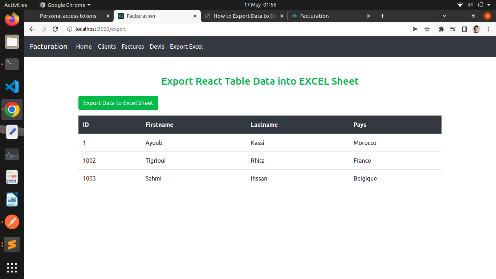
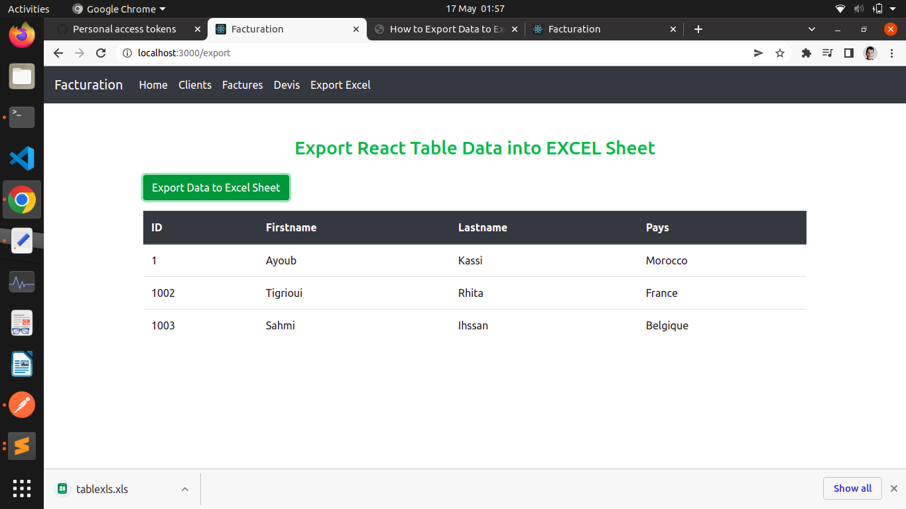

# DotnetFacturation
Fcaturation using Dotnet and React Frameworks

---

## Install dependencies and Run Project

> cd Front && npm install
> cd Facturation && dotnet run
> cd Front && npm start

